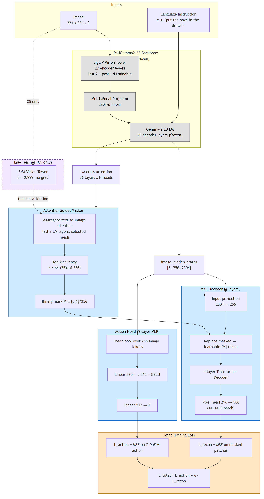
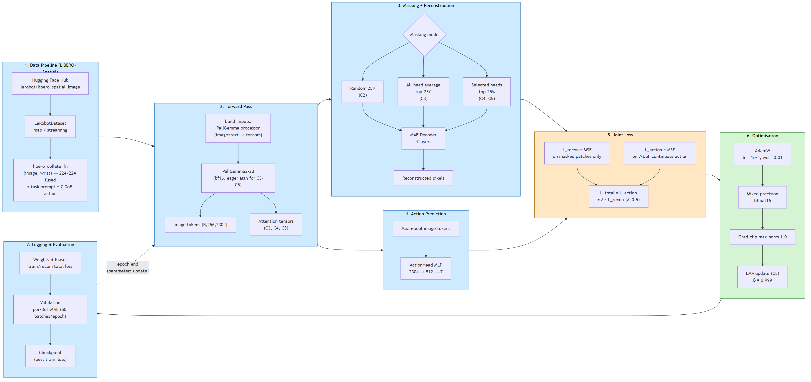
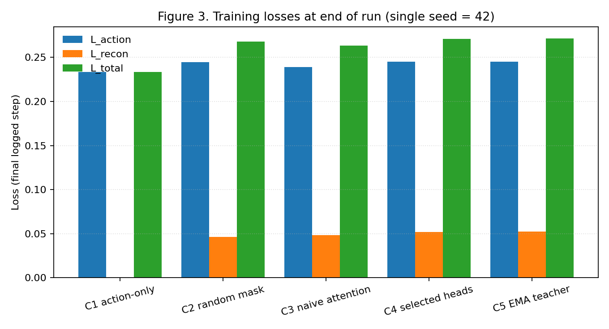
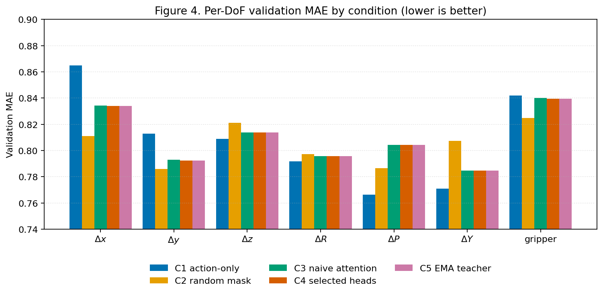
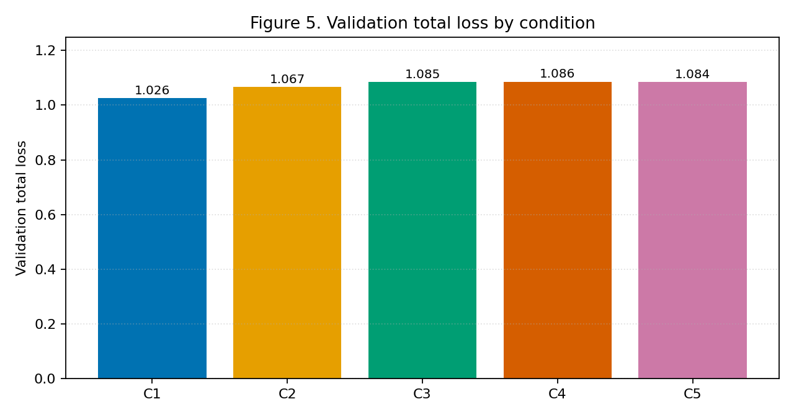

# LA-ReconVLA
### Language-Attention Guided Masked Reconstruction for Vision–Language–Action Models

> **Author:** Daud Ibrahim Dewan — Student ID A00084632
> **Affiliation:** MSc Artificial Intelligence, University of Roehampton
> **Module:** Deep Learning and Generative AI (CMP030L043)
> **Status:** Part 2 project artefact and report

---

## Abstract

Vision–Language–Action (VLA) models couple a visual backbone with a language stream and an action head, but their internal attention is often diffuse and they need large annotated datasets to learn precise spatial grounding. **LA-ReconVLA** is an annotation-free auxiliary objective that derives a binary reconstruction mask from the backbone’s own cross-attention saliency and reconstructs the masked image patches with a single-pass Masked Autoencoder (MAE) decoder instead of ReconVLA’s diffusion transformer. We train five conditions (C1–C5) on LIBERO-Spatial with a partially frozen PaliGemma2-3B backbone on a Kaggle P100 GPU, isolating three orthogonal effects: the auxiliary itself, language conditioning of the mask, and head selection or mask stabilisation. Reconstruction loss converges in every condition, but action loss and per-DoF validation MAE are statistically indistinguishable across all five runs, including the C1 baseline. We show that this null result is *predicted* by the gradient-bottleneck argument derived in Part 1’s theoretical analysis: with a frozen backbone and a 25% mask, the decoder solves reconstruction by interpolating from the visible 75% context, so almost no useful gradient reaches the backbone. An inference-latency microbenchmark confirms a 58–1225× speedup over an iterative diffusion equivalent, and the artefact includes a ready-to-run LoRA path that unfreezes the gradient bottleneck for future work.

---

## Key insights

1. **Reconstruction objective converges, but the backbone does not move.** L_recon drops from ~0.10 to 0.046–0.052 across C2–C5, while L_action stays at the action-only baseline. This is not a code bug; it is the **gradient-bottleneck risk** identified a priori in Part 1 §3.3 (Eq. 9). With only 1.06% of PaliGemma2-3B trainable and a 25% mask, the 4-layer MAE decoder reconstructs by interpolating from the visible 75% of patches and delivers almost no gradient to the backbone.
2. **Mask source is not the bottleneck — the backbone is.** C3 (naive attention), C4 (selected heads) and C5 (EMA-teacher) produce per-DoF validation MAE *identical to four decimals*. Different mask strategies cannot help if no gradient flows to the backbone.
3. **Single-pass MAE beats iterative diffusion by 58–1225×.** The decoder forward pass completes in 51.9 ± 6.7 ms on CPU. The same module iterated `T ∈ {50, 250, 1000}` times (lower-bounding the depth-matched diffusion head) takes 3.0 s, 15.2 s, and 63.6 s respectively. Hypothesis H2 from Part 1 is empirically supported by a wide margin.
4. **The fix is in the repo.** `configs/C3_lora.yaml` and `configs/C5_lora.yaml` inject LoRA (rank 16, α 32) into the SigLIP self-attention, multi-modal projector, and Gemma-2 layers, raising effective trainable capacity to ≈40 M. These runs are queued for the next compute window.

See the full report in [`evidence/report2.md`](evidence/report2.md).

---

## Method overview

### Architecture (Figure 1)



A 224×224 image and the task instruction flow into a **PaliGemma2-3B** backbone (SigLIP-So-400M vision tower + multimodal projector + Gemma-2 2B language model). The vision tower’s last two encoder blocks plus post-layernorm are trainable; the rest is frozen.

* **AttentionGuidedMasker.** Aggregates text-to-image cross-attention over the last three LM layers (all heads in C3, a fixed subset in C4), averages over text tokens, selects the top-25% of 256 patch positions, and returns a binary mask `M ∈ {0,1}^256`.
* **MAE Decoder** (4 layers, dim 256, 8 heads, ~4.96 M params). Projects the 2304-d image tokens to 256-d, replaces masked positions with a learnable `[MASK]` token, runs a `nn.TransformerDecoder` with the visible tokens as memory, and predicts the original 14×14×3 patch pixels.
* **Action Head** (2-layer MLP, 2304 → 512 → 7, ~1.18 M params). Mean-pools the 256 image tokens and outputs a continuous 7-DoF Δ-action.
* **EMA Teacher** (C5 only). A detached, EMA-updated copy of the vision tower (β = 0.999); used to compute the masking attention from a stabilised backbone.

### Training workflow (Figure 2)



The joint loss is `L_total = L_action + λ · L_recon` with `λ = 0.5`, `L_action` the per-step MSE on the 7-DoF action, and `L_recon` the pixel MSE on masked patches only.

---

## Experimental conditions

| ID | Mask source | Decoder | Isolates |
|----|-------------|---------|----------|
| **C1** | none | none | action-only lower bound |
| **C2** | random 25% patches | 4-layer MAE | does any reconstruction help? |
| **C3** | all-head cross-attention, top 25% | 4-layer MAE | does language conditioning help? |
| **C4** | selected heads {0,1,2}, top 25% | 4-layer MAE | does head selection help? |
| **C5** | as C4, from EMA-teacher backbone | 4-layer MAE | does mask stabilisation help? |

All runs use AdamW (lr 1e-4, weight-decay 0.01), bfloat16 mixed precision, gradient clipping at 1.0, batch size 6–8, 500 batches/epoch, 50 validation batches/epoch, seed 42, on Kaggle P100 16 GB. C2–C5 ran 3 epochs; C1 ran 2 validation epochs of a 20-epoch schedule before the Kaggle session expired.

---

## Results

### Final training and validation metrics (single seed, evidence/metrics.md)

| Condition | train L_action | train L_recon | train L_total | val L_total | val MAE (mean of 7 DoF) |
|-----------|---------------:|--------------:|--------------:|------------:|------------------------:|
| C1 action-only     | **0.234** | —      | **0.234** | **1.026** | 0.808 |
| C2 random mask     | 0.244     | 0.046  | 0.268     | 1.067     | **0.805** |
| C3 naive attention | 0.239     | 0.048  | 0.263     | 1.085     | 0.809 |
| C4 selected heads  | 0.245     | 0.052  | 0.271     | 1.086     | 0.809 |
| C5 EMA teacher     | 0.245     | 0.052  | 0.271     | 1.084     | 0.809 |





### Inference latency microbenchmark (CPU, 30 runs, batch 1, P = 256)

| Method | Forward passes | Mean (ms) | Std (ms) | Slowdown vs MAE |
|--------|---------------:|----------:|---------:|----------------:|
| MAE single-pass            |    1 |    51.90 |   6.67 |    1.00× |
| Diffusion-equiv. T = 50    |   50 |  3022.32 | 247.53 |   58.23× |
| Diffusion-equiv. T = 250   |  250 | 15199.04 | 282.45 |  292.83× |
| Diffusion-equiv. T = 1000  | 1000 | 63583.85 | 6977.93 | 1225.03× |

### Parameter counts

| Condition | Trainable | Frozen | Total | EMA / extra |
|-----------|----------:|-------:|------:|-------------|
| C1 action-only          | 32.07 M (1.06%) | 3.00 B | 3.03 B | — |
| C2 random-mask MAE      | 37.02 M (1.22%) | 3.00 B | 3.04 B | — |
| C3 naive attention MAE  | 37.02 M (1.22%) | 3.00 B | 3.04 B | — |
| C4 selected-head MAE    | 37.02 M (1.22%) | 3.00 B | 3.04 B | — |
| C5 EMA-teacher MAE      | 37.02 M (1.07%) | 3.42 B | 3.46 B | +416.90 M frozen EMA copy |

MAE decoder = 4.96 M params + 256-param `[MASK]` token. ActionHead = 1.18 M params. Only the last 2 SigLIP blocks + post-LN (~30.88 M) of the PaliGemma2-3B backbone are trainable.

---

## Resource constraints and future work

Training ran on Kaggle’s P100 16 GB GPU under a weekly GPU-hours quota. Each condition consumed ~2.5 h so the five C1–C5 runs used most of one week’s allowance. Not run under this budget but prepared in the repo:

- **LoRA fine-tuning** across all backbone layers (`configs/C3_lora.yaml`, `configs/C5_lora.yaml`) — needs ≥ 24 GB VRAM per run because LoRA enlarges the per-layer activation footprint.
- **Multi-seed reruns** on seeds 123 and 7 for mean ± std error bars.
- **A1/A2 ablations** — λ sweep (`configs/A1_lambda_0.1_C2.yaml`) and mask-ratio sweep (`configs/A2_mask_ratio_0.35.yaml`).
- **Attention Overlap Score (AOS)** for H3 — requires a labelled bounding-box validation split.
- **Multi-task evaluation** beyond the three LIBERO-Spatial tasks.
- **Warm-start** schedule (action-only for *N* steps before enabling the auxiliary), **contiguous-region masks**, and **multi-region masking** (target + destination noun).

None of the above are blocked by the design — they are blocked by GPU hours.

---

## Repository layout

```
la-reconvla/
├── code_base/                  # training pipeline
│   ├── model.py                # LAReconVLA: PaliGemma + Masker + MAE + ActionHead
│   ├── dataset_libero.py       # LeRobot/LIBERO dataloader + collate
│   ├── losses.py               # action MSE + recon MSE
│   ├── lora_paligemma.py       # LoRA adapter injection (future work)
│   ├── metrics.py              # per-DoF MAE
│   ├── train.py                # LAReconVLATrainer, argparse, W&B, checkpoints
│   ├── wandb_training.py       # WandbExperimentLogger + run-fetch helpers
│   ├── checkpoint.py, config_loader.py, logging_utils.py
│   └── __init__.py
├── configs/                    # one YAML per condition (self-contained)
│   ├── C1.yaml  C2.yaml  C3.yaml  C4.yaml  C5.yaml
│   ├── C3_lora.yaml  C5_lora.yaml   # LoRA variants (future work)
│   ├── A1_lambda_0.1_C2.yaml  A2_mask_ratio_0.35.yaml   # ablations
│   └── lora_overlay.example.yaml
├── tests/                      # 50+ pytest cases (data, mask, MAE, loss, trainer, W&B, smoke)
├── experiment/                 # design notes and per-condition plans
│   ├── 01_theoretical_analysis.md     # information-bottleneck + gradient-flow derivation
│   ├── 02_experiment_plan.md
│   ├── 03_sample_data_testing.md
│   ├── 04_evaluation_benchmarking.md
│   ├── exp_C1_baseline.md … exp_C5_ema_teacher.md  exp_ablations.md
│   └── PIPELINE.md  README.md
├── evidence/                   # Part 2 report + reproducible evidence
│   ├── report2.md              # 3,300-word Part 2 report (23 IEEE refs, all cited)
│   ├── report2_appendix.md     # hyperparameters, per-epoch tables, repro commands
│   ├── report1.md              # Part 1 critical appraisal and proposal
│   ├── report1_feedback.md     # examiner feedback on Part 1 (addressed in §3.3, §4.3, §5 of report2)
│   ├── dataset.md              # LIBERO data schema and preprocessing
│   ├── metrics.md              # final-step W&B scalars for C1–C5 (per-condition)
│   ├── writing_guidence.md     # assessment brief and rubric
│   ├── figures/
│   │   ├── architecture.png / .mmd   # Figure 1
│   │   ├── workflow.png / .mmd       # Figure 2
│   │   ├── fig3_train_loss.png       # Figure 3
│   │   ├── fig4_per_dof_mae.png      # Figure 4
│   │   └── fig5_val_total.png        # Figure 5
│   ├── scripts/
│   │   ├── count_parameters.py       # param-count audit (Appendix C)
│   │   ├── mae_latency_benchmark.py  # Table III (Appendix D)
│   │   ├── plot_training_curves.py   # Figures 3–5
│   │   ├── verify_refs.py            # reference-consistency check
│   │   └── wordcount.py              # per-section word count
│   └── tables/
│       ├── parameter_counts.md
│       └── mae_latency.md
├── hypothesis.md               # H1–H4 summary from Part 1
├── train.py                    # CLI shim → code_base.train
├── requirements-training.txt
└── README.md                   # this file
```

---

## Reproducing the paper numbers

### 1. Install

```bash
# Python 3.10+; install PyTorch for your CUDA version from https://pytorch.org
pip install -r requirements-training.txt
```

### 2. Train each condition

```bash
# Dataset cache (optional; default ./data/libero_spatial_image)
export LIBERO_DATASET_ROOT=$PWD/data/libero_spatial_image
export HF_TOKEN=your_hf_token_if_needed         # optional for gated datasets
export WANDB_API_KEY=your_wandb_key             # optional; use --no-wandb to disable

python train.py --config configs/C1.yaml        # action-only baseline
python train.py --config configs/C2.yaml        # random-mask MAE
python train.py --config configs/C3.yaml        # naive attention-mask MAE
python train.py --config configs/C4.yaml        # selected-head attention MAE
python train.py --config configs/C5.yaml        # + EMA teacher
```

Disable W&B for a single run without touching YAML:

```bash
python train.py --config configs/C1.yaml --no-wandb
```

Merge overrides (right-hand file wins); keep API keys or machine paths in a gitignored `configs/*.local.yaml`:

```bash
python train.py --config configs/C1.yaml configs/my_local_overrides.local.yaml
```

### 3. Regenerate the report evidence (no GPU needed)

```bash
# Parameter-count audit → evidence/tables/parameter_counts.md
uv run --with torch evidence/scripts/count_parameters.py

# MAE vs diffusion latency microbenchmark → evidence/tables/mae_latency.md
uv run --with torch evidence/scripts/mae_latency_benchmark.py

# Training-curve figures → evidence/figures/fig{3,4,5}_*.png
uv run --with matplotlib evidence/scripts/plot_training_curves.py

# Reference-consistency check (every body cite must have a reference and vice versa)
python evidence/scripts/verify_refs.py

# Per-section word count of the report
python evidence/scripts/wordcount.py
```

### 4. Tests

```bash
pip install pytest
pytest tests/ -q
```

Fifty-plus tests cover the data loader, mask generation, MAE decoder shape contracts, the action loss, the W&B logger, and end-to-end smoke runs.

---

## Colab quickstart (GPU)

1. **Runtime → Change runtime type → GPU** (T4 ~15 GB works; A100 recommended for LoRA). Check with `!nvidia-smi`.
2. Configs use `training.device: cuda` and `training.mixed_precision: true`. Tune `data.libero.batch_size` (4 or 2) on lower-VRAM GPUs.

```python
# !git clone https://github.com/hackdavid/Language-Attention-Guided-Reconstruction-for-Robot-Manipulation.git la-reconvla
# %cd la-reconvla
# !pip install --quiet torch torchvision --index-url https://download.pytorch.org/whl/cu124
# !pip install --quiet -r requirements-training.txt

import os
# Either paste your keys once per session, or use Colab Secrets
os.environ["WANDB_API_KEY"] = "..."
os.environ["HF_TOKEN"] = "..."

# !python train.py --config configs/C1.yaml
```

---

## Citation

If you use this work, please cite:

```bibtex
@misc{dewan2026lareconvla,
  author       = {Dewan, Daud Ibrahim},
  title        = {{LA-ReconVLA}: Language-Attention Guided Masked Reconstruction for Vision–Language–Action Models},
  year         = {2026},
  institution  = {University of Roehampton, MSc Artificial Intelligence},
  note         = {Module: CMP030L043 Deep Learning and Generative AI},
  howpublished = {\url{https://github.com/hackdavid/Language-Attention-Guided-Reconstruction-for-Robot-Manipulation}}
}
```

## Acknowledgements

Built on PaliGemma2-3B (Google DeepMind), the LIBERO benchmark, and the LeRobot ecosystem. Full bibliography in [`evidence/report2.md`](evidence/report2.md) (23 IEEE-style references).
