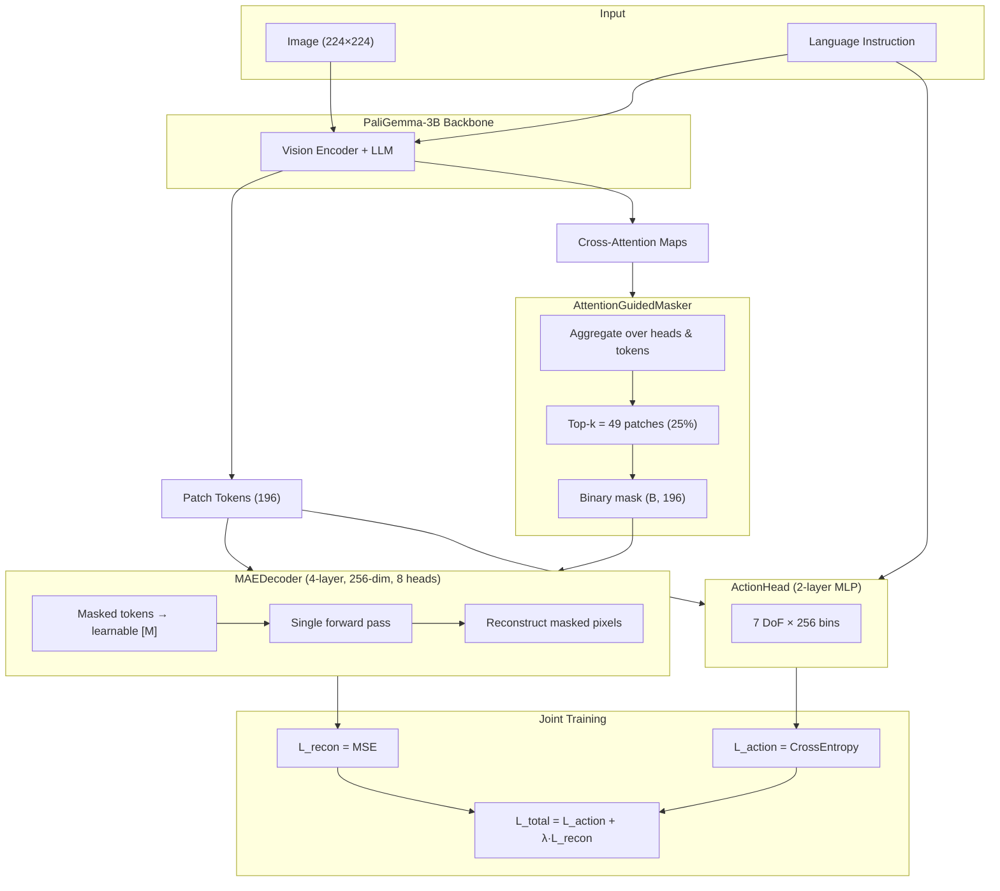
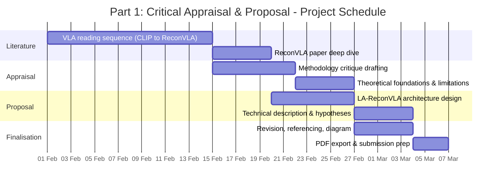

# Part 1: Critical Appraisal and Proposal
## ReconVLA and LA-ReconVLA: Language-Attention Guided Masked Reconstruction for Vision-Language-Action Models

**Module:** Deep Learning and Generative AI (CMP030L043)  
**Word Count:** ~2,400

---

## Abstract

Vision-Language-Action (VLA) models suffer from dispersed visual attention, causing imprecise robot manipulation. ReconVLA [1] addresses this through an implicit grounding paradigm where a diffusion transformer reconstructs gaze regions from the VLM backbone's visual tokens. This report contributes: (1) a critical appraisal identifying methodological limitations -gaze annotation dependency, inference overhead, and missing ablations; (2) LA-ReconVLA, a concrete architecture replacing gaze regions with cross-attention-derived masks and the diffusion head with a single-pass MAE decoder; and (3) measurable hypotheses (within 5% task success, 3–5× lower latency) for Part 2 validation. The proposal is designed for implementation on LIBERO-Spatial with constrained compute (T4 GPU).

---

## I. Introduction and Summary

### A. Problem Statement

Current VLA models -including OpenVLA [2] and RT-2 [3] -generate robot actions by feeding an image and language instruction into a vision-language backbone. A fundamental limitation is that the model's visual attention is dispersed across the entire scene rather than concentrating on the manipulation target [1]. When instructed to "put the black bowl in the drawer," the model fails to allocate sufficient attention to the bowl, leading to imprecise action prediction. This *visual grounding problem* -the failure to spatially align visual attention with the manipulation target -is the root cause of manipulation failures in long-horizon tasks.

### B. ReconVLA's Architectural Contribution

ReconVLA [1] introduces an implicit grounding paradigm. The model identifies a gaze region -the spatial area in the input image corresponding to the target object -and trains a diffusion transformer head to reconstruct that region from the VLM backbone's internal visual tokens (reconstructive tokens). The reconstruction objective forces the backbone to encode geometrically precise, spatially structured representations: if the backbone does not encode the shape and position of the target, it cannot reconstruct the gaze region. At inference, the same backbone produces improved action predictions. ReconVLA curates a pretraining dataset of over 100k trajectories and 2 million samples from BridgeData V2, LIBERO, and CALVIN [1].

### C. Key Results and Positioning

ReconVLA outperforms OpenVLA and RT-2-style baselines on LIBERO-Spatial, LIBERO-Long, and CALVIN benchmarks, with improved attention focus visualised via attention maps [1]. Real-robot qualitative results are reported. ReconVLA distinguishes itself from explicit grounding (external detection modules) and chain-of-thought grounding (bounding box output before action) by using visual reconstruction as a purely internal supervisory signal, requiring no external module or explicit bounding box output at inference [1]. The remainder of this report is structured as follows: Section II presents a critical appraisal; Section III proposes LA-ReconVLA; Section IV concludes; Appendices provide timeline and hyperparameter details.

---

## II. Critical Appraisal

ReconVLA [1] achieves strong benchmark results and introduces a novel implicit grounding paradigm. The following appraisal interrogates its methodology, compute requirements, and evaluation scope to identify limitations that motivate our proposal.

### A. Theoretical Foundations

ReconVLA's design connects to established deep learning principles. The reconstruction objective functions as a self-supervised auxiliary loss analogous to the Masked Autoencoder (MAE) framework [4], where masking forces the encoder to retain representation richness. The diffusion transformer head implements DDPM-style denoising [5], modelling the conditional distribution of scene tokens given reconstructive tokens. This relates to the representation bottleneck: by requiring the backbone's outputs to carry sufficient information to reconstruct a masked region, the model is regularised against shortcut features. Gradients from the reconstruction loss flow through the reconstructive tokens into the VLM backbone via backpropagation, reshaping internal representations. The vision-language alignment foundation -dual encoding of image and text in a shared space [6] -underpins the VLM backbone architecture inherited from LLaVA-style models [7]. The VLA lineage, from Decision Transformer [10] (actions as sequence tokens) to ViLT [11] (single-transformer multimodal fusion), establishes the conceptual foundation for action prediction from vision-language representations. Table I summarises the conceptual alignment between ReconVLA and prior work.

*Table I: Theoretical alignment of ReconVLA with prior frameworks.*

| Concept | MAE [4] | DDPM [5] | ReconVLA [1] |
|---------|---------|----------|-------------|
| Masking target | Random patches | N/A (generation) | Gaze region |
| Reconstruction | Pixel MSE | Iterative denoising | Diffusion transformer |
| Supervision | Self-supervised | Generative | Auxiliary (action + recon) |
| Gradient path | Direct to encoder | T-step denoising | Via reconstructive tokens |

### B. Methodology Critique: Gaze Region Dependency

The gaze region used as the reconstruction target is defined by robot eye-tracking or gaze annotation from the training dataset [1]. The paper does not specify how gaze regions are obtained across BridgeData V2, LIBERO, and CALVIN -a methodological gap. If gaze regions are derived heuristically (e.g., bounding box around the object mentioned in the instruction), this introduces a circular dependency: the reconstruction target is computed from the same language instruction that guides the action. The model may shortcut by attending to language cues rather than developing genuine geometric understanding of the scene.

Critically, ReconVLA provides no ablation isolating the effect of gaze region definition. An ablation comparing reconstruction of gaze regions versus random patch regions would establish whether the performance gain stems from geometric understanding or merely from the presence of any reconstruction auxiliary task. If random masking performed similarly, it would suggest the gain comes from the auxiliary task itself, not from gaze-specific grounding. Without this ablation, baseline fairness is compromised -we cannot attribute improvement to implicit grounding specifically.

### C. Computational and Scalability Limitations

Training requires 8× A100 (80GB) GPUs and 2 million samples [1], a significant barrier to academic reproduction and fine-tuning in low-resource settings. The diffusion transformer adds inference overhead: diffusion models require T iterative denoising steps per generation. In robot manipulation, latency directly affects control frequency; ReconVLA does not report inference latency benchmarks -a critical omission for a robotics paper. Diffusion Policy [8] explicitly benchmarks inference latency; diffusion-based policies typically operate at ~1–2 Hz due to iterative denoising, limiting real-time control. ReconVLA does not report comparable metrics. Multi-view image inputs are required (per the official repository), limiting deployment in environments without calibrated multi-camera setups.

### D. Dataset and Evaluation Scope

LIBERO and CALVIN [9] are simulation benchmarks. Real-world results are limited to qualitative demonstrations on a single robot arm setup [1]; the generalisation claim is not strongly evidenced. CALVIN [9] evaluates long-horizon task chains with a fixed language instruction vocabulary -it does not assess open-vocabulary instruction following, which is the core promise of VLA models. OpenVLA [2] addresses open-vocabulary instructions on a broader distribution. The 100k trajectory pretraining dataset assembles BridgeData V2, LIBERO, and CALVIN; partial overlap with evaluation environments risks data leakage, potentially inflating generalisation metrics. Without explicit train/test split documentation, leakage risk cannot be ruled out. The paper does not report reconstruction quality metrics (e.g., FID, perceptual similarity) -only task success rates. It is difficult to verify whether high task success correlates with high reconstruction quality or whether the model finds a shortcut.

---

## III. Proposed Method: LA-ReconVLA

Having identified these limitations, we now propose LA-ReconVLA, an architecture that addresses gaze dependency and inference overhead while remaining feasible under constrained compute.

### A. Problem Identification and Motivation

ReconVLA's visual grounding depends on heuristically defined gaze regions, which may not generalise across diverse manipulation scenarios and introduces a potential circular dependency with language conditioning. The diffusion transformer imposes inference overhead unsuitable for real-time control. The research question is: *Can we replace gaze-region supervision with language-driven attention masking to derive reconstruction targets that are semantically grounded in the task instruction, while replacing the diffusion transformer with a computationally efficient Masked Autoencoder (MAE) decoder?*

The proposal addresses two limitations simultaneously: (1) gaze annotation dependency, and (2) inference overhead from iterative denoising. Table II summarises the comparison.

*Table II: ReconVLA vs LA-ReconVLA.*

| Aspect | ReconVLA [1] | LA-ReconVLA (Proposed) |
|--------|--------------|------------------------|
| Reconstruction target | Gaze region (annotated) | Top-k attention patches |
| Decoder | Diffusion transformer | MAE (4-layer) |
| Inference passes | T denoising steps | Single forward pass |
| External annotations | Gaze/eye-tracking | None |

### B. Technical Description

**Architecture Overview.** LA-ReconVLA (Language-Attention Guided Masked Reconstruction VLA) uses a PaliGemma-3B backbone (partially frozen), an AttentionGuidedMasker, a 4-layer MAE decoder, and an action head. PaliGemma is a VLM in the LLaVA [7] lineage -vision encoder projected into LLM token space -chosen for its accessibility and compatibility with cross-attention extraction. Inputs are a 224×224 image and a language instruction.

**Step 1 -Extract Cross-Attention Maps.** In the VLM backbone, cross-attention layers compute attention scores between language tokens and image patch tokens. These scores indicate which image patches the model attends to when processing the instruction. Aggregate attention scores across all language tokens and selected layers (last 3 layers recommended to reduce noise from frozen layers) to produce a saliency map A ∈ ℝ^(H×W) over the 196 patch positions.

**Step 2 -Attention-Guided Masking.** Apply a top-k threshold to A. Select the k most attended patches (k = 49, i.e., 25% of 196). These patches are semantically relevant to the instruction -analogous to gaze regions but derived endogenously. Produce a binary mask M ∈ {0,1}^196. Replace masked patch tokens with a learnable [MASK] token before passing to the decoder. Algorithm 1 formalises the procedure.

*Algorithm 1: AttentionGuidedMasker.*

```
Input: Cross-attention maps Attn ∈ R^(B×H×L×P), P=196
Output: Binary mask M ∈ {0,1}^(B×P)
1: A ← mean over heads(Attn)
2: A ← mean over language tokens(A)     // A ∈ R^(B×P)
3: k ← 49  // top 25%
4: for each batch b do
5:     idx ← argsort(A[b], descending)[:k]
6:     M[b] ← zeros(P); M[b][idx] ← 1
7: return M
```

*Failure-mode mitigation:* If cross-attention from a frozen backbone is noisy, aggregate across the last 3 layers (weighted) or fall back to self-attention over image tokens; document the choice in Part 2.

**Step 3 -MAE Decoder.** Replace the diffusion transformer with a 4-layer transformer decoder (hidden dimension 256, 8 attention heads). The decoder receives: (a) unmasked patch tokens from the backbone, and (b) learnable mask tokens at masked positions. It reconstructs pixel values at masked positions in a single forward pass. The reconstruction loss is:

$$L_{recon} = \text{MSE}(\text{decoder}(\mathbf{x}_{unmasked}, \mathbf{x}_{mask}), \mathbf{p}_{original})$$

where $\mathbf{p}_{original}$ denotes the original pixel values of the masked patches.

**Step 4 -Joint Training.** The total loss is:

$$L_{total} = L_{action} + \lambda \cdot L_{recon}$$

where $L_{action}$ is cross-entropy over discretised action bins (7 DoF × 256 bins per DoF) and λ is a hyperparameter (default 0.5; ablations: 0.1, 0.5, 1.0).

**System Architecture.** Figure 1 illustrates the data flow. The Mermaid source is provided for reproducibility.



*Figure 1: LA-ReconVLA system architecture. Gradients from L_recon flow through the MAE decoder to the backbone; L_action trains the action head. Rendered: `diagrams/la_reconvla_architecture.svg`.*

**Design Rationale.** The MAE decoder requires a single forward pass -no iterative denoising -reducing inference latency. For geometric understanding, reconstruction need not be photorealistic; coarse reconstruction at correct locations suffices to force the backbone to encode spatial structure [4]. Language attention maps are derived directly from the task instruction, making the masking target semantically grounded without external gaze annotations.

### C. Theoretical Justification

**Self-supervised learning.** MAE [4] produces stronger visual representations than contrastive methods when reconstruction targets are semantically meaningful. Masking high-attention patches forces the backbone to predict task-relevant content.

**Information bottleneck.** Masking high-attention patches and requiring their reconstruction creates a bottleneck [12] -the model must retain spatial information in its latent representation that would otherwise be dropped.

**Gradient flow.** Unlike diffusion, where gradients traverse many timesteps before reaching the backbone, the MAE decoder provides direct gradient signals to the encoder, improving training stability.

**Attention regularisation.** Using attention maps as masking targets creates an implicit loop: the attention map determines what is masked; the reconstruction loss improves backbone features; better features produce sharper attention maps.

### D. Hypothesised Outcomes

The following hypotheses are measurable and will be tested in Part 2. Null hypotheses (H0) are stated for clarity.

- **H1 (Task success):** LA-ReconVLA achieves within 5% of ReconVLA's task success rate on LIBERO-Spatial without using gaze annotations. *H0:* No significant difference. Tested via simulation rollouts.

- **H2 (Inference latency):** LA-ReconVLA exhibits 3–5× lower inference latency than ReconVLA due to the single-pass MAE decoder. *H0:* No significant latency reduction. Tested via 100 forward-pass latency benchmark.

- **H3 (Attention focus):** LA-ReconVLA shows higher attention concentration on task-relevant objects than a baseline VLA without reconstruction. *H0:* No difference in AOS. Measured by Attention Overlap Score (AOS): IoU between top-25% attention patches and ground-truth object bounding box.

- **H4 (Annotation-free generalisation):** LA-ReconVLA maintains task success on out-of-distribution instructions where gaze annotations are unavailable. Mentioned as aspirational; full testing deferred to future work.

Part 2 will implement LA-ReconVLA on LIBERO-Spatial with constrained compute (Colab T4 GPU), training on 3 tasks × 50 demos, and report Conditions 1–4: baseline VLA, LA-ReconVLA with random masking (ablation), LA-ReconVLA with λ ablation, and LA-ReconVLA full. Code, configs, and random seeds will be provided for reproducibility.

---

## IV. Conclusion

This report presented a critical appraisal of ReconVLA [1] and proposed LA-ReconVLA as an alternative architecture. The appraisal identified three substantive limitations: (1) gaze region dependency and potential circular dependency with language conditioning, (2) inference overhead from the diffusion transformer without reported latency benchmarks, and (3) missing ablations on region selection and reconstruction quality metrics. LA-ReconVLA addresses the first two by replacing gaze annotations with cross-attention-derived masking and the diffusion head with a single-pass MAE decoder. The proposal is technically grounded in self-supervised learning theory [4] and designed for feasible implementation on LIBERO-Spatial under constrained compute. Part 2 will empirically validate hypotheses H1–H3 and report ablation results across four experimental conditions.

A limitation of our proposal is that LA-ReconVLA assumes cross-attention maps are accessible in the backbone; architectures without explicit cross-attention would require adaptation (e.g., self-attention over image tokens). Future work includes real-robot evaluation, extension to LIBERO-Long, and investigation of H4 (annotation-free generalisation).

*Ethics note:* This work uses simulation data (LIBERO) only; no human or animal data are involved. Deployment of VLAs in real-world robotics carries latency and safety constraints that should be evaluated before deployment.

---

## References

[1] W. Song et al., "ReconVLA: Reconstructive vision-language-action model as effective robot perceiver," arXiv:2508.10333, 2025. [Online]. Available: https://arxiv.org/abs/2508.10333

[2] M. J. Kim et al., "OpenVLA: An open-source vision-language-action model," arXiv:2406.09246, 2024. [Online]. Available: https://arxiv.org/abs/2406.09246

[3] A. Brohan et al., "RT-2: Vision-language-action models transfer web knowledge to robotic control," in Proc. 7th Conf. Robot Learn. (CoRL), 2023, pp. 2165–2183.

[4] K. He, X. Chen, S. Xie, Y. Li, P. Dollár, and R. Girshick, "Masked autoencoders are scalable vision learners," in Proc. IEEE/CVF Conf. Comput. Vis. Pattern Recognit. (CVPR), 2022, pp. 16000–16009.

[5] J. Ho, A. Jain, and P. Abbeel, "Denoising diffusion probabilistic models," in Proc. Adv. Neural Inf. Process. Syst. (NeurIPS), vol. 33, 2020, pp. 6840–6851.

[6] A. Radford et al., "Learning transferable visual models from natural language supervision," in Proc. 38th Int. Conf. Mach. Learn. (ICML), vol. 139, 2021, pp. 8748–8763.

[7] H. Liu, C. Li, Q. Wu, and Y. J. Lee, "Visual instruction tuning," in Proc. Adv. Neural Inf. Process. Syst. (NeurIPS), 2023.

[8] C. Chi et al., "Diffusion policy: Visuomotor policy learning via action diffusion," in Proc. Robot.: Sci. Syst. (RSS), 2023.

[9] O. Mees, L. Hermann, E. Rosete-Beas, and W. Burgard, "CALVIN: A benchmark for language-conditioned policy learning for long-horizon robot manipulation tasks," IEEE Robot. Autom. Lett., vol. 7, no. 2, pp. 7327–7334, 2022.

[10] L. Chen et al., "Decision transformer: Reinforcement learning via sequence modeling," in Proc. Adv. Neural Inf. Process. Syst. (NeurIPS), vol. 34, 2021, pp. 15084–15097.

[11] W. Kim, B. Son, and I. Kim, "ViLT: Vision-and-language transformer without convolution or region supervision," in Proc. 38th Int. Conf. Mach. Learn. (ICML), vol. 139, 2021, pp. 5583–5594.

[12] N. Tishby and N. Zaslavsky, "Deep learning and the information bottleneck principle," arXiv:1503.02406, 2015. [Online]. Available: https://arxiv.org/abs/1503.02406

---

## Appendix A: Project Timeline (Gantt Chart)

*Figure A1* shows the planned schedule for Part 1 (Critical Appraisal and Proposal) from 1 February 2026 to 5 March 2026. Part 1 submission deadline: 6 March 2026.



*Figure A1: Gantt chart for Part 1 coursework (1 Feb 2026 - 5 Mar 2026). Generated via Matplotlib: `diagrams/part1_gantt_chart.png` (script: `diagrams/generate_gantt_chart.py`).*

### Appendix A.1: Milestone Summary

| Milestone | Start | End | Deliverable |
|-----------|-------|-----|-------------|
| Literature review | 2026-02-01 | 2026-02-14 | Reading notes on 9-paper sequence |
| ReconVLA analysis | 2026-02-15 | 2026-02-19 | Critique outline |
| Proposal development | 2026-02-20 | 2026-02-26 | LA-ReconVLA specification |
| Finalisation | 2026-02-27 | 2026-03-05 | Part 1 report (PDF) |

---

## Appendix B: Hyperparameter Summary

*Table B1: LA-ReconVLA hyperparameters for Part 2 implementation.*

| Parameter | Value | Notes |
|-----------|-------|-------|
| Image size | 224×224 | Standard ViT input |
| Patch count | 196 | 14×14 grid |
| Masking ratio (k) | 49 (25%) | Top-k attended patches |
| MAE decoder layers | 4 | Hidden dim 256, 8 heads |
| λ (recon weight) | 0.5 | Ablations: 0.1, 0.5, 1.0 |
| Action bins per DoF | 256 | 7 DoF total |
| Batch size | 8 | Gradient accumulation ×4 |
| Backbone | PaliGemma-3B | Last 2 layers fine-tuned |

---

## Appendix C: Architecture Comparison

*Table C1: ReconVLA vs LA-ReconVLA -detailed comparison.*

| Component | ReconVLA [1] | LA-ReconVLA |
|-----------|--------------|-------------|
| Supervision | Gaze region + action | Attention mask + action |
| Reconstruction target | Exogenous (gaze) | Endogenous (cross-attn) |
| Decoder type | Diffusion transformer | MAE (4-layer) |
| Inference | T denoising steps | Single pass |
| Annotations | Gaze/eye-tracking | None |
| Compute (training) | 8× A100 | T4 (Colab) |
